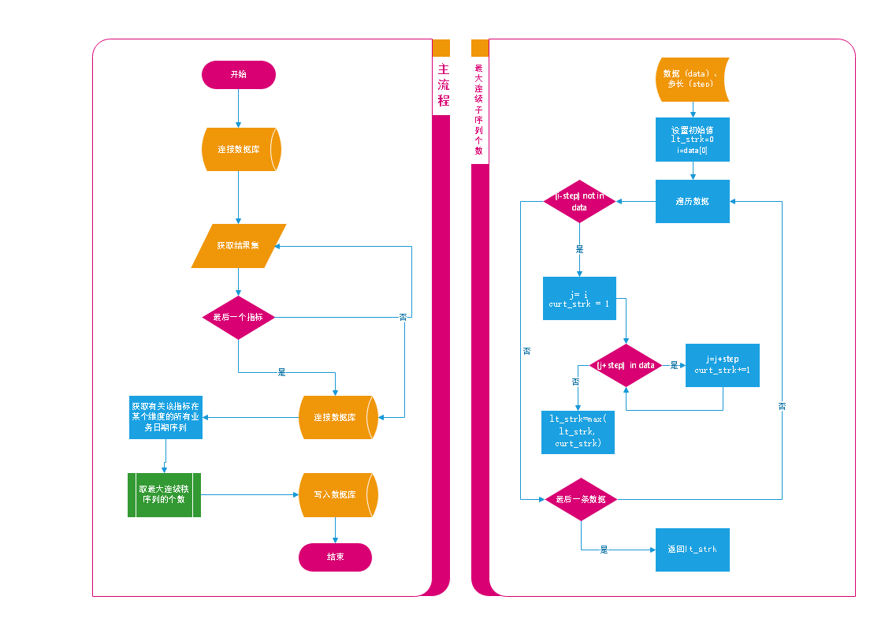
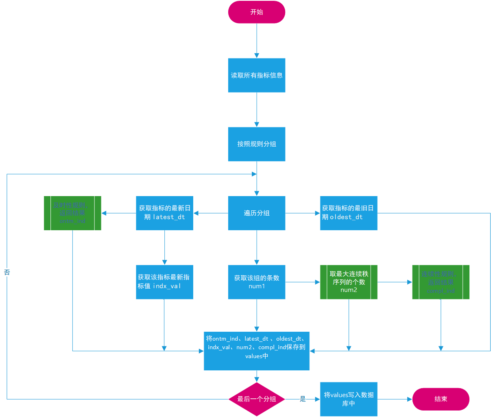
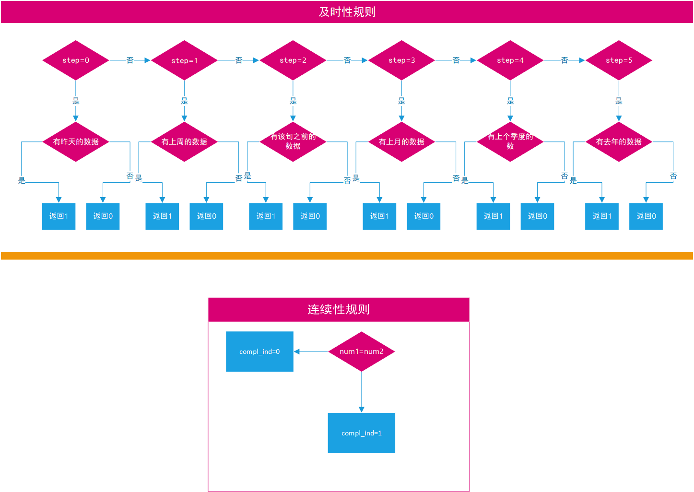

# 指标检查程序模块介绍

## 直接查询

&emsp; 直接查询指标事实表中的所有指标，其检查**SQL**如下: 

```plsql
-- 用于查询指标的及时性与连续性，但不可以查询其最大周期数
select
	distinct indx_id,
	dt_attr_idtfy,
	regn_cd,
	data_src_cd,
	dt_min,
	dt_max,
	first_val,
	case
		when dt_attr_idtfy = '0' then (dt_max-dt_min = indx_count-1)::int
		when dt_attr_idtfy = '1' then null
		when dt_attr_idtfy = '2' then null
		when dt_attr_idtfy = '3' then (date_part('year', age(dt_max, dt_min))* 12 + date_part('month', age(dt_max, dt_min)) = indx_count-1)::int
		when dt_attr_idtfy = '4' then ((date_part('year', age(dt_max, dt_min))* 12 + date_part('month', age(dt_max, dt_min)))/ 3 = indx_count-1)::int
		when dt_attr_idtfy = '5' then (date_part('year', age(dt_max, dt_min))= indx_count-1)::int
		else null end is_continuous,
		case
			when dt_attr_idtfy = '0' then (now()::date-dt_max::date = 1 )::int
			when dt_attr_idtfy = '1' then null
			when dt_attr_idtfy = '2' then null
			when dt_attr_idtfy = '3' then (date_trunc('month', now()+ '-1 month')= dt_max::date)::int
			when dt_attr_idtfy = '4' then (date_trunc('quarter', now()+ '-3 month')= dt_max::date)::int
			when dt_attr_idtfy = '5' then (date_trunc('year', now()+ '-1 year')= dt_max::date)::int
			else null end timeliness
		from
			(
			select
				indx_id,
				dt_attr_idtfy,
				dt,
				regn_cd,
				indx_val,
				data_src_cd,
				min(dt)over(partition by indx_id,regn_cd,dt_attr_idtfy) dt_min,
				max(dt)over(partition by indx_id,regn_cd,dt_attr_idtfy) dt_max,
				count(*) over(partition by indx_id,regn_cd,dt_attr_idtfy) indx_count,
				first_value(indx_val)over(partition by indx_id,regn_cd,dt_attr_idtfy order by dt desc ) first_val
			from
				biz_current.a_bi_indx_fact ) tab;
```

**注**：上述sql仅可以检查日期维度为日、月、季度、年的指标


## 检查结果入库

### 方式一：

&emsp;&emsp;利用上述语句的结果，变量结果集，取每个指标的业务日期序列，求出最大的连续周期数，并将其写入数据库中。<br/>

#### 算法描述

---
**主流程**<br/>

1、获取所有上述SQL的结果集results 。<br/>

2、遍历result结果集，获取下一条数据。<br/>

3、进入**最大连续子序列算法**，获取该指标的最大连续周期数<br/>

4、是否为最后一个指标（是，进入第5步；否，返回第2步）<br/>

5、将结果写入数据库中，结束。<br/>


**最大连续子序列算法**<br/>

1、输入序列值(data)、步长(step)<br/>

2、设置初始值：it_strk=0<br/>

3、遍历data 获取下一条数据 i<br/>

4、(i-step) not in data  (是，进入第6步；否，进入第5步)<br/>

5、是否为最后一条数据  (是，进入第10步；否，进入第3步)<br/>

6、j= i ，curt_strk = 1  <br/>

7、(j+step)  in data  (是，进入第8步；否，进入第9步) <br/>

8、j=j+step，curt_strk+=1；执行第7步<br/>

9、lt_strk=max(lt_strk,curt_strk)<br/>

10、返回lt_strk，该值为该序列下，以step为步长的最大子序列的长度<br/>


#### 流程图


其具体流程如下:




### 方式二：

关于指标的三个性质，都是通过代码实现的。


#### 算法


主流程：



各个子流程：



使用方法：

直接调用即可，可配置的选项

1、可配置db\_info.json 中添加可配置的数据库信息（选在仅仅支持pg数据库）

2、可添置的日日志部分（现在的日志文件是配置是滚动日志，切按按照天分割文件，仅index\_check2.0，略微配置）

运行实例：

  无参运行                    带参运行
--------------------------- -----------------------------------
  python index\_check.py      python index\_check.py default
  python index\_check2.0.py   python index\_check2.0.py default

  


   

