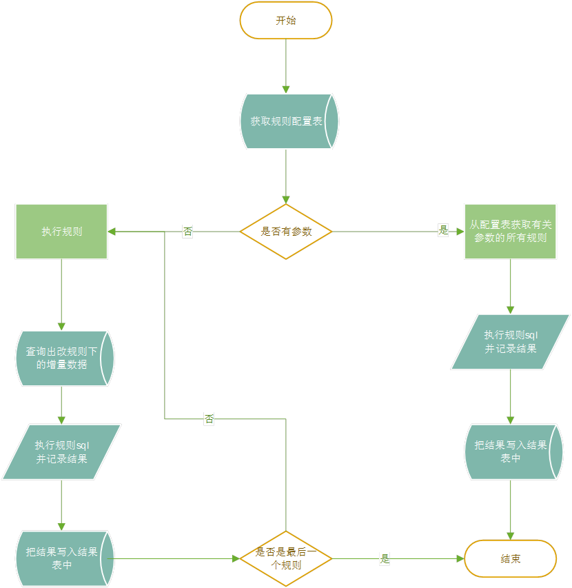

# 数据检查模块介绍

---

## 场景介绍

&emsp;&emsp;在做数据处理、分析、服务之前，则需要对数据做数据探查的工作。一般情况下数据探查时间周期会比上述那几个步骤的时间周期要长的多，其原因是做数据探查的指标形成阶段，会耗费大量的时间，其中数据质量的好坏，往往成为这指标是否可用的一个很大的影响因素。<br/>

&emsp;&emsp;本程序主要将对数据质量的检查结果执行并保留下来，把程序抽象出来，其实该程序就是利用`psycopg2`的包做的一驱动。

## 程序组件

&emsp;&emsp;该程序提炼出三个单独运行的组件（`get_init.py`、`exec_sql.py`、`rule_exec.py`）。

### 初始化组件(`get_init.py`)

&emsp;&emsp;该组件主要的作用是，在首次使用该程序，将 数据质量检核结果表(dqc_data_qlty_tsk_rest)、数据质量检核任务配置表(dqc_data_qlty_tsk_cfg)、数据质量检核规则表(dqc_data_qlty_rule)实例化到`db_info.json`中的数据库中。若，库中有相关的sql，请不要使用该程序。<br/>

**主要流程**

```flowchart
st=>start: 开始
op=>operation: 读取文件夹config
db_info=>operation: 读取db_info.json连接数据库
sql_info=>operation: 读取《config》文件夹下的sql文件
sql_exec=>operation: 按顺序取下一个sql文件，并执行
db_close=>operation: 提交操作，关闭数据库
cond=>condition: 最后一个sql文件
sub1=>subroutine: 子流程
io=>inputoutput: 输入输出框
e=>end: 结束
st->op
op->db_info
db_info->sql_info
sql_info->sql_exec->cond
cond(yes)->db_close->e
cond(no)->sql_exec
```

**使用方法**

1. **无参数**

`python get_init.py`

2. **有参数**

`python get_init.py -l default`

**参数介绍**

```shell
python get_init.py --help
usage: get_init.py [-h] [-s SCHEMA] [-l DBLINK]


optional arguments:
  -h, --help  show this help message and exit
  -s SCHEMA   所在的schema
  -l DBLINK   输入配置文件db_info的key值，默认为default
```

### SQL驱动(exec_sql)

&emsp;&emsp;该组件主要是功能是执行SQL语句，将sql语句的输出结果打印到窗口，或者输出到文件中，现只支持输出成csv文件（若需要输出成其他文件，后续可随时添加）。<br/>

**主要流程**

```flow
st=>start: 开始
op=>operation: 执行Python脚本
console_out=>operation: 结果集显示/输出文件
io=>inputoutput: 输入sql
e=>end: 结束
st->io->op->console_out->e
```

**使用方法**

**有参数**

`python exec_sql.py -s "select 1 ;"`<br/>

该组件在使用时必须含有`-s`的参数，其他的可选参数及其作用见下

**参数介绍**

```shell
python exec_sql.py --help

usage: exec_sql.py [-h] -s SQL [-l DBLINK] [-o {console,csv}]


optional arguments:
  -h, --help        show this help message and exit
  -s SQL            输入一个sql，并用双引号引住 例： python exec_sql -s "select 1;"
  -l DBLINK         输入配置文件db_info的key值，默认为default
  -o {console,csv}  仅仅可以输入，console、csv常用的格式
```

### 日常执行(`rule_exec)

&ensp;&ensp;该程序主要是利用*pandas*库从*postgresql*数据库中读取数据并进行处理，以实现的功能有以下两个。<br/>
**功能**

1. *自动读取数据库中表增量数据进行检核*<br/>
2. *写出表的相关参数，对其数据进行全量检核*<br/>

**算法**

1. 读取配置表中状态所有有效的数据<br/>
2. 判断是否输入参数<br/>

```
a)    输入参数：
```

<br/>

```
i.      查找所有的跟该参数相关的规则记录
```

<br/>

```
ii.      执行规则sql
```

<br/>

```
iii.      输出并记录检查结果
```

<br/>

```
b)   未输入参数：
```

<br/>

```
i.      遍历规则
```

<br/>

```
ii.      找出改规则下的增量数据
```

<br/>

```
iii.      对增量数据执行规则sql
```

<br/>

```
iv.      输出并记录检查结果
```

<br/>

3. 结束<br/>

**主要流程**



**使用方法**

1. *直接执行python  check_rule/rule_exec.py 对应第一个功能*<br/>
2. *直接执行python  check_rule/rule_exec.py biz_origin.o_yjglj_emcy_evt 对应第二个功能 即：对表biz_origin.o_yjglj_emcy_evt 进行全量检核*<br/>
